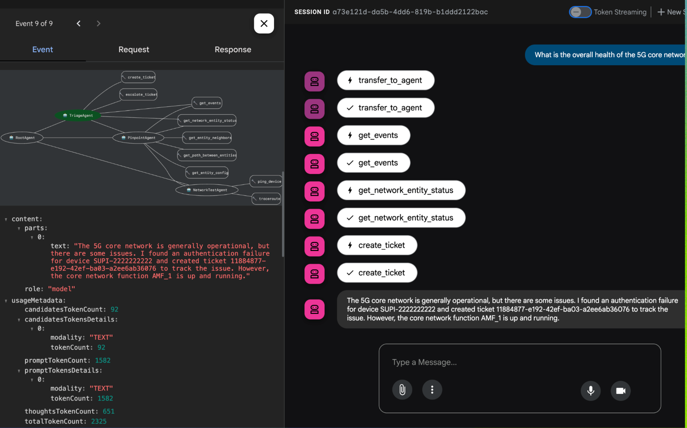

# 5G Network SRE Agent


### .env 
Please update the .env files for ADK agent and Agent engine/Agentspace

## Step 1 : Run the ADK Agent locally
```bash 
adk web
```
## Step 2 : Deploy ADK Agent to Agent Engine
```bash
python deploy-ae.py
```

## Step 3 : Register agent in Agentspace

```bash 
bash agentspace-register.sh

```

### Questions/Messages to Ask

TriageAgent

General Status & Events:


"What is the current status of AMF_1?"


"What is the current status of UE_2"


"Are there any events with the result code 'authentication_failure'?"


"Show me all events related to the device SUPI-1111111111."


"Did transaction 1002 complete successfully?"


Ticket Creation/Escalation:

"Create a ticket for the authentication failure of SUPI-2222222222."


"Escalate this ticket to John Doe."

PinpointAgent  

Connectivity Issues:


"Is there a path between SMF_1 and gNB_2?"


"What are the neighbors of AMF_1?"


"What is the configuration of AMF_1?"


"Why is device SUPI-2222222222 failing to authenticate?"

Complex Scenarios:

"We're seeing a lot of NAS_Registration_Request failures. What's going on?"

"Diagnose the issue with transaction 1001."

NetworkTestAgent (These will usually be triggered indirectly via PinpointAgent)

Ping/Traceroute (if you integrate these capabilities):


"Can AMF_1 ping 192.168.1.1?" 


"Can AMF_1 ping 192.168.1.2?" 

"Run a traceroute from gNB_1 to SMF_1."  

Combined/More Open-Ended:


"What is the overall health of the 5G core network?" 




